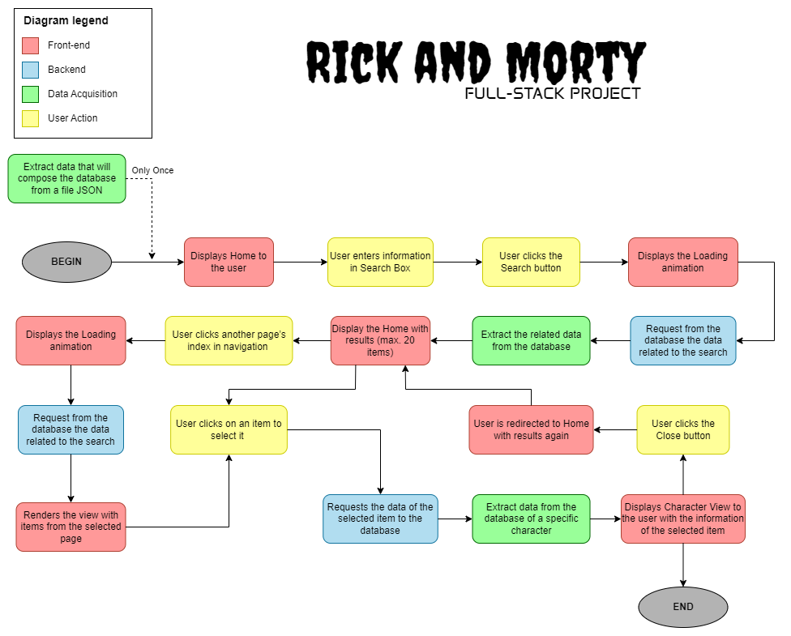

# Full-Stack Project: Rick and Morty

Project developed under the mentorship of [Eitree Academy](https://www.eitree.dev/academy/) for the purpose of learning and practicing Full-Stack programming.

## Introduction

The development of the project is divided into three stages:

- <u>Data acquisition:</u> Extracting data from JSON documents with psycopg2;
- <u>Backend:</u> Communication between the frontend and the database using Flask and SQLAlchemy;
- <u>Frontend:</u> Graphical interface and requests to the backend using React.js.



---

## How to Run the Backend

### Prerequisites

Make sure you have the following installed:

- [Python 3.10+](https://www.python.org/downloads/)
- [PostgreSQL](https://www.postgresql.org/download/)

---

### 1. Clone the Repository

```bash
git clone https://github.com/your-username/your-repo.git
cd your-repo/backend
```

---

### 2. Create and Activate a Virtual Environment

It is recommended to use a virtual environment to isolate project dependencies.

**Windows:**

```bash
python -m venv venv
venv\Scripts\activate
```

**Linux / macOS:**

```bash
python3 -m venv venv
source venv/bin/activate
```

> After activation, your terminal prompt should show `(venv)`.

---

### 3. Install Dependencies

With the virtual environment active, install all required packages:

```bash
pip install -r requirements.txt
```

---

### 4. Configure the Database

The application uses **PostgreSQL**. Make sure PostgreSQL is running and create the database:

```sql
CREATE DATABASE "RickAndMorty";
```

Then, update the connection string in `main.py` if needed:

```python
app.config['SQLALCHEMY_DATABASE_URI'] = 'postgresql://postgres:<your_password>@localhost/RickAndMorty'
```

Replace `<your_password>` with your PostgreSQL password.

---

### 5. Populate the Database (Data Acquisition)

Run the data ingestion script to populate the database with Rick and Morty characters:

```bash
python script/script.py
```

---

### 6. Run the Application

Start the Flask development server:

```bash
python main.py
```

The server will start at `http://localhost:5000` by default.

---

## 📡 API Endpoints

| Method | Endpoint       | Description                            |
| ------ | -------------- | -------------------------------------- |
| `GET`  | `/search`      | Returns a paginated list of characters |
| `GET`  | `/search/<id>` | Returns a single character by ID       |

### Query Parameters for `/search`

| Parameter  | Type     | Default | Description                |
| ---------- | -------- | ------- | -------------------------- |
| `name`     | `string` | `""`    | Filter characters by name  |
| `page`     | `int`    | `1`     | Page number                |
| `per_page` | `int`    | `20`    | Number of results per page |

**Example request:**

```
GET http://localhost:5000/search?name=rick&page=1
```

---

### A. Data acquisition

Python packages used:

```
pip install psycopg2
pip install sqlalchemy
```

### B. Backend

To install the necessary packages:

```
pip install -r requirements.txt
```

### C. Frontend

To be able to run the frontend of this project, you must have [Node.js](https://nodejs.org/en/download/current) installed.

```
npm install axios
```

---

## Steps Details

### 1. Data Acquisition

Script in Python language developed with the psycopg2 lib (lib used to extract data from a JSON document and populate the database with this data).

### 2. Backend

The backend receives requests from the frontend and communicates with the database to obtain the required information.

Requests can come in three ways:

- <u>string name:</u> term to be searched in the database in the name column;
- <u>int page:</u> term that represents the requested page;
- <u>empty:</u> by default, if no information is provided, data from 1 to 20 that makes up the first page will be requested (i.e., page=1).

To handle frontend requests, two routes are used:

- <u>get_characters:</u> receives a string that is the search performed by the user in the graphical interface made with React.js. Using this string, search the database for data that contains this string in the "name" column. Additionally, it uses an attribute called "index", which is a positive integer referring to the desired page number (for example, index=1 returns items 1 to 20 of the search results; index=2 returns items 21 to 40; and so on). By default, if index is not provided, it would be understood that index=1. And if there is not the maximum quantity on the page to return, it returns only those available (for example, index=1 has only 4 items, therefore, it only returns 21, 22, 23, 24).
- <u>get_by_id:</u> returns a list item selected by the user. It has only one attribute, this attribute is called "id" and is a positive integer.

### 3. Frontend

The project's frontend is developed in React.js and has four view states:

- <u>Home:</u> where the user can type their search in a text box, and when clicking on the "Search" button they are redirected to the next page.
- <u>Loading:</u> where the user can type their search in a text box, and when clicking on the "Search" button they are redirected to the next page.
- <u>Search:</u> results related to the search performed are displayed, with the results shown in a pagination list and each page in this list will display a maximum of 20 result items. The user can navigate to any page in the pagination list through a browser at the bottom of the screen. If the user clicks on an item in the search, they are redirected to the next page.
- <u>View:</u> information about the search result selected on the previous screen is displayed. If the user clicks the "Close" button, he is redirected back to the previous state (Search).
